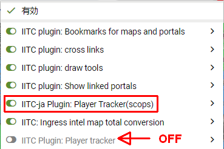
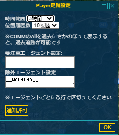

# Player Tracker (otusscops)変更版(player-tracker-ja-scops)

## はじめに
これは、[IITC-ja: Ingress Intel Total Conversion 日本語化版](https://ingress.love/iitc-ja/)を元にNightHackzさんが以下の修正を加えたプラグインをもとに   
- AGのトレース破線色をRES/ENLで色分け
- AGの追跡時間を3,6,12,24時間と指定可能にした
- AGの履歴詳細画面の履歴数を指定可能にした

さらに、以下の機能をotusscopsが追加実装したものです
- 指定AGのログを直近10分以内に確認した場合、アラートを表示する

## インストール
[Plugin Download](https://github.com/otus-scops/player-tracker-scops/raw/master/player-tracker-ja-scops.user.js)  

- あらかじめ、標準の「Plaert tracker」はOFFに設定してください。 
 
- 上記「Plugin Download」リンクを選択し、開いた画面で「インストール」ボタンを押してください。 

## 注意事項
~~原則、新規機能追加や、既存機能の拡張はしません。~~ 
不具合のある機能の修正、使えなくなってしまった機能の削除は行う可能性があります。 
本スクリプトの利用にかかわる一切の責任は利用者にあり、翻訳者および製作者・配布元が責任を負うことはありません。 

## ライセンス
本スクリプトのライセンスは、[ISC Licence](https://www.isc.org/downloads/software-support-policy/isc-license/)とさせて頂きます。

## 設定画面
「Player足跡」のメニューがツールボックスに追加されますので、それを選択して下さい。 
この画面が表示されますので、選択して「OK」ボタンを押して下さい。 
通知許可がない場合にのみ、「通知許可」ボタンが表示されます。 
通知が許可されていない場合はalert window似て通知を行います。 

